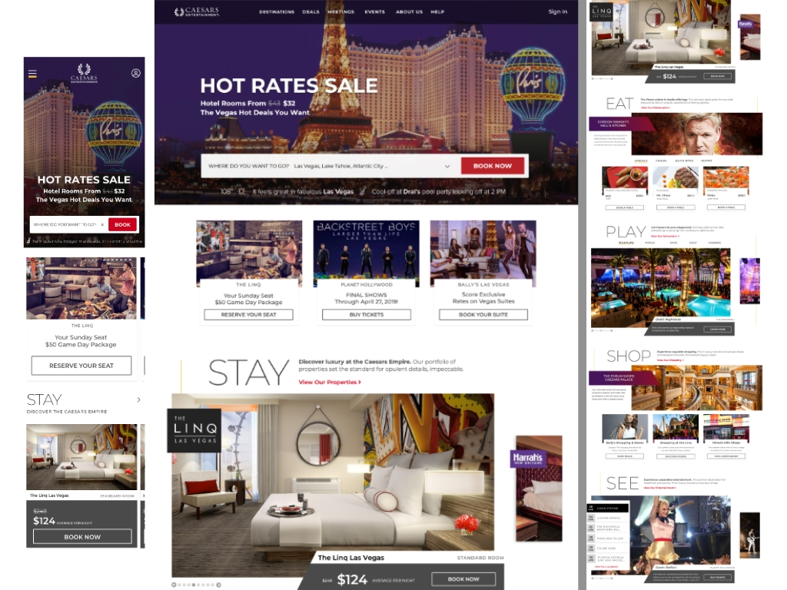
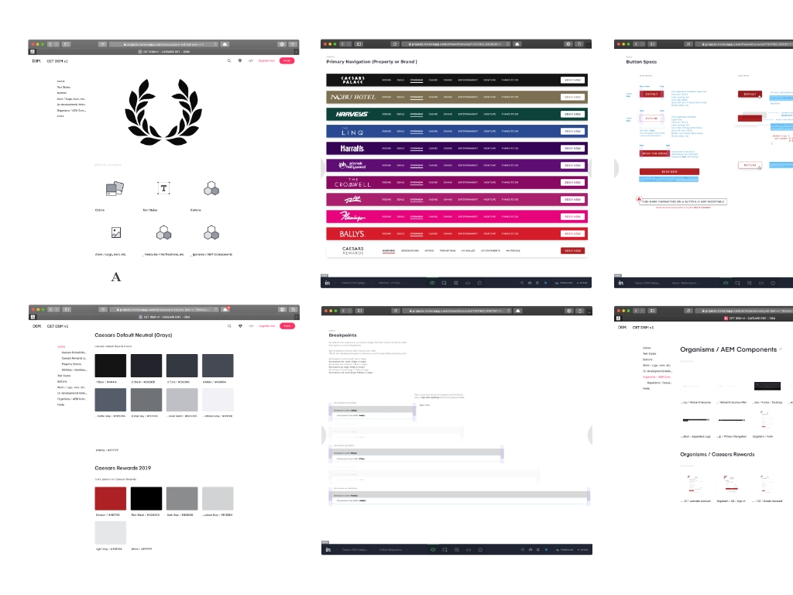
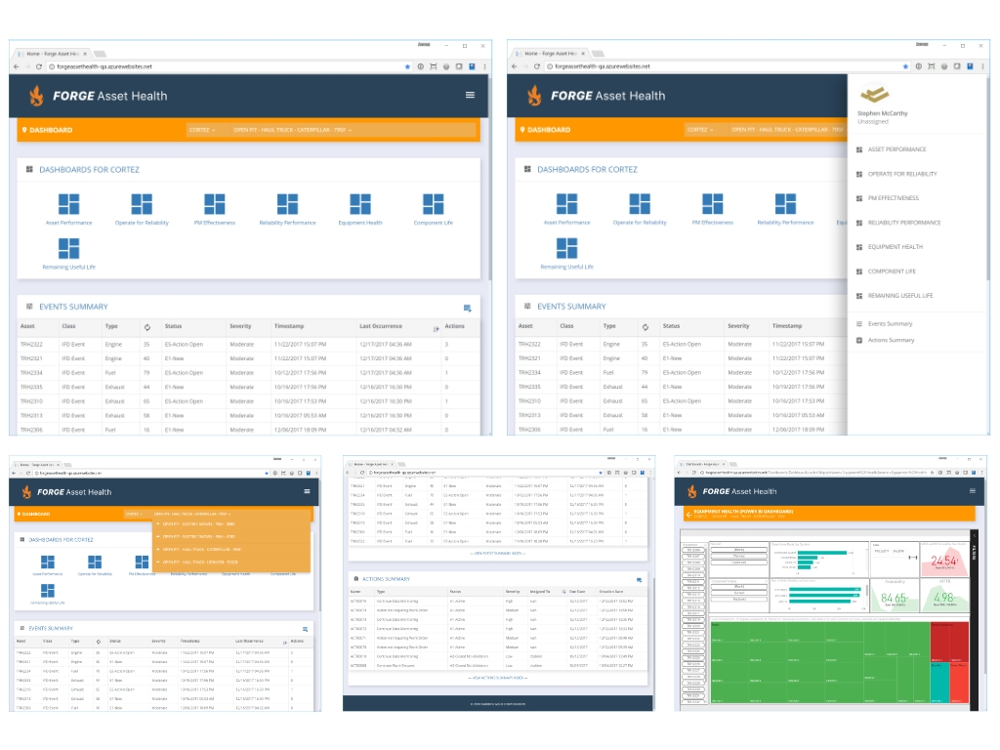
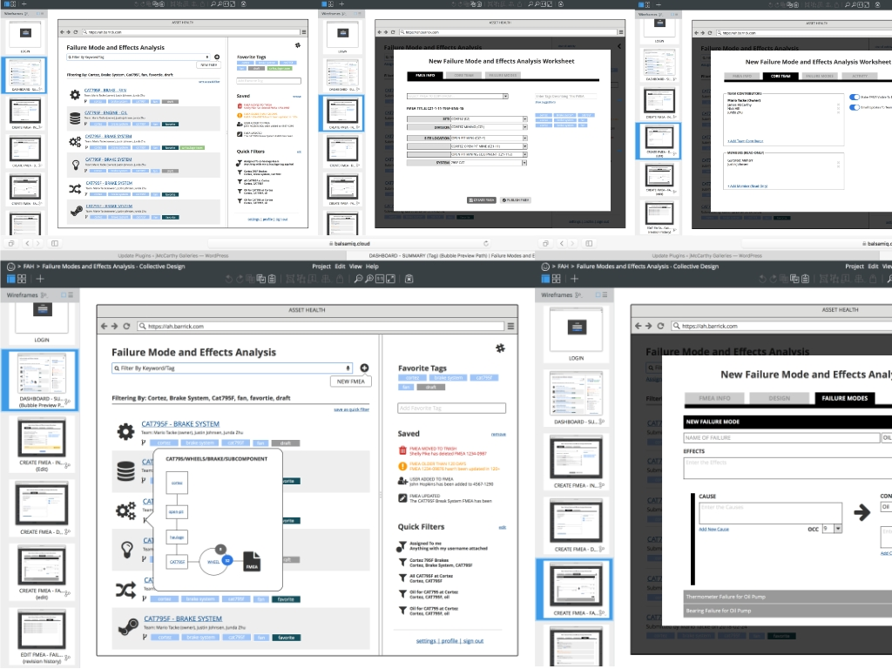
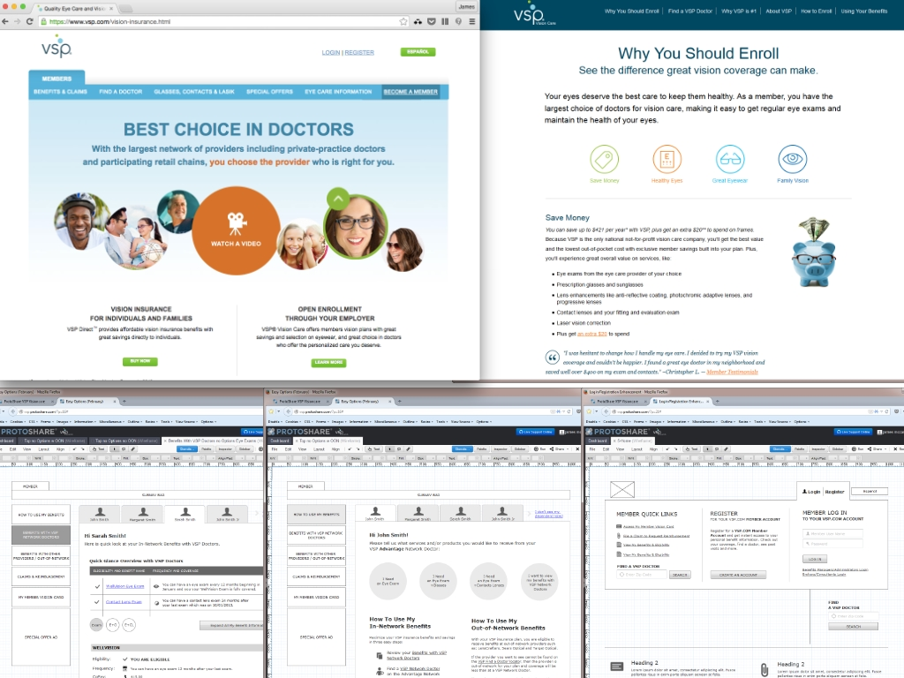
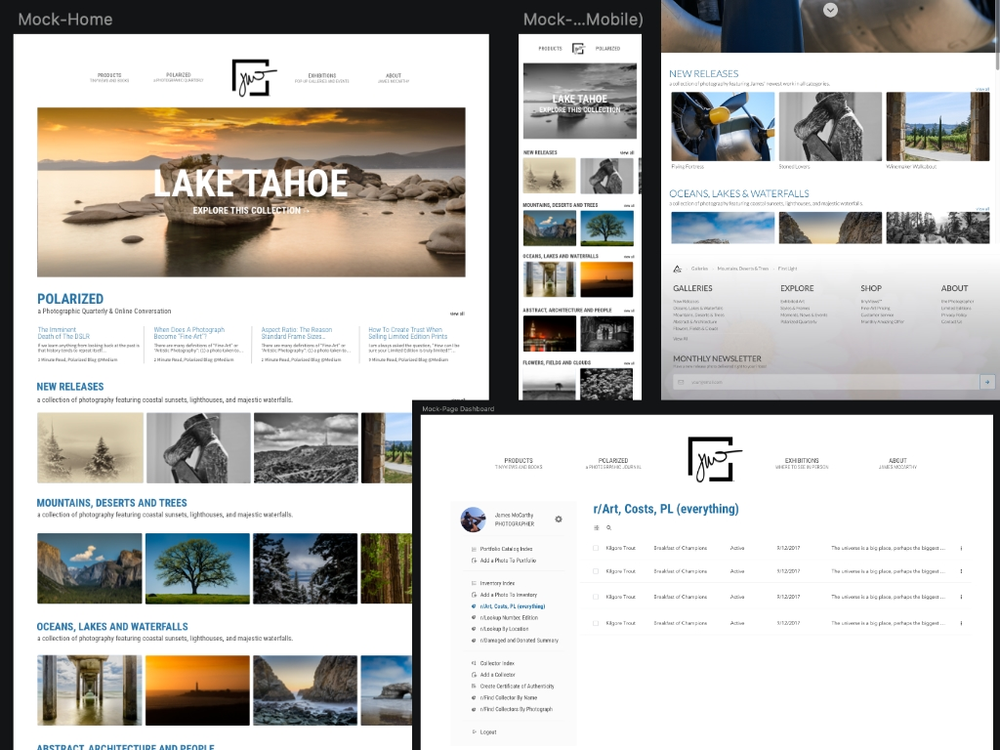

# me
Passionate and creative UI UX Designer & Front End Software Engineer, as well as Fine-art photographer established in 1996. Lives in a designer’s world crafting wire-frames to high-fidelity mock-ups and prototypes. Also, codes in multiple languages, as well as speaks SEO/SEM, digital marketing, content strategy, and social. Works well with others on a team and loves an Agile environment with Scrum.

# creator + nomad coder : return(projects);  
Twenty-five years of experience in prettifying the Internet through Design, User-Experience, and code for mobile and desktop. Explore a few ways I have made the Internet a better place to browse.

### Desktop | Mobile | Caesars Entertainment
While at Caesars Entertainment, I have been focused on creating wire-frames and high-fidelity mock-ups for their amazing brands, such as, Caesars Palace, Planet Hollywood, Harrah's, The Linq, Flamingo, Bally's, and Paris. Also I collaborated closely with Chicago-based consultancy, Bounteous, on the caesars.com redesign and interactive agency, Verb, on Caesars Entertainment property page templates.

### Design System | Caesars Entertainment
Also while at Caesars, I aided in the creation in their first Design System Manager using Sketch and InVision to standardize a style guide for internal and external contract design agencies and developers.

### Desktop | Barrick Gold
Created low-fidelity wire-frames for React/Redux application to automate the creation and maintenance of FMEAs (Failure Modes and Effects Analysis) and Predictive Maintenance. Also, worked with an Agile Barrick team, Microsoft consultants and data scientists to build a proof-of-concept, web-based predictive analytics dashboard for Barrick Gold Nevada Gold mine sites Cortez and Gold Strike.

### Desktop | VSP Global (Vision Service Plan)
Worked on front-end UI UX design, development and maintenance of Member, Client and Broker Portals, including white-labeled sites for MetLife, Cigna, Sight for Students and Blue Shield. Responsible for wire framing, mocking-up design using Adobe Creative Suite applications, prototyping with Protoshare, creating A/B tests using Optimizely and coding of functional elements in JavaScript +jQuery and Magnolia CMS.

### Desktop | Mobile | jM Galleries (freelance)
Have consulted with some of the most well-known technology companies, including, Barrick Gold, Intel, California State University Sacramento, VSP, Microsoft, University of Nevada, University of Nevada School of Medicine, GadgetMe Magazine, jM Galleries and Appmatrix, providing UI UX design, content-strategy, development, social and photography to meet business objectives of various stake holders. 

work with me / 951-708-1831 / <a target="_resume" href="https://github.com/sjamesmccarthy">github</a> / <a target="_resume" href="https://twitter.com/jmgalleriesusa">twitter</a> / <a target="_resume" href="https://instagram.com/jmgalleriesusa">instagram</a> / <a target="_resume" href="https://linkedin.com/in/jmccarthyusa">LinkedIn / <a target="_resume" href="resume-jmccarthy.pdf">view resume</a>

